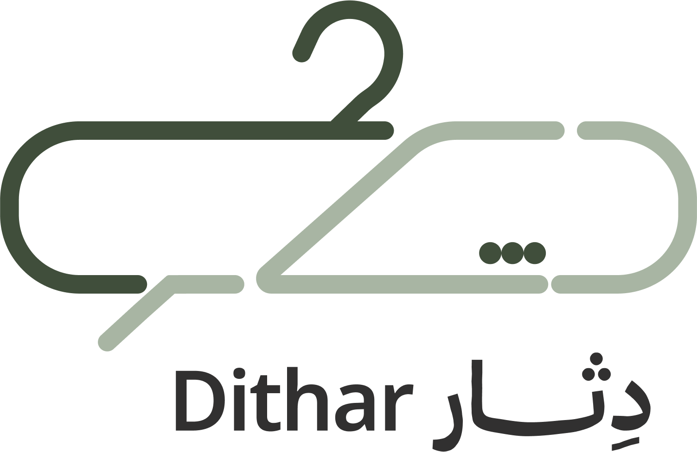
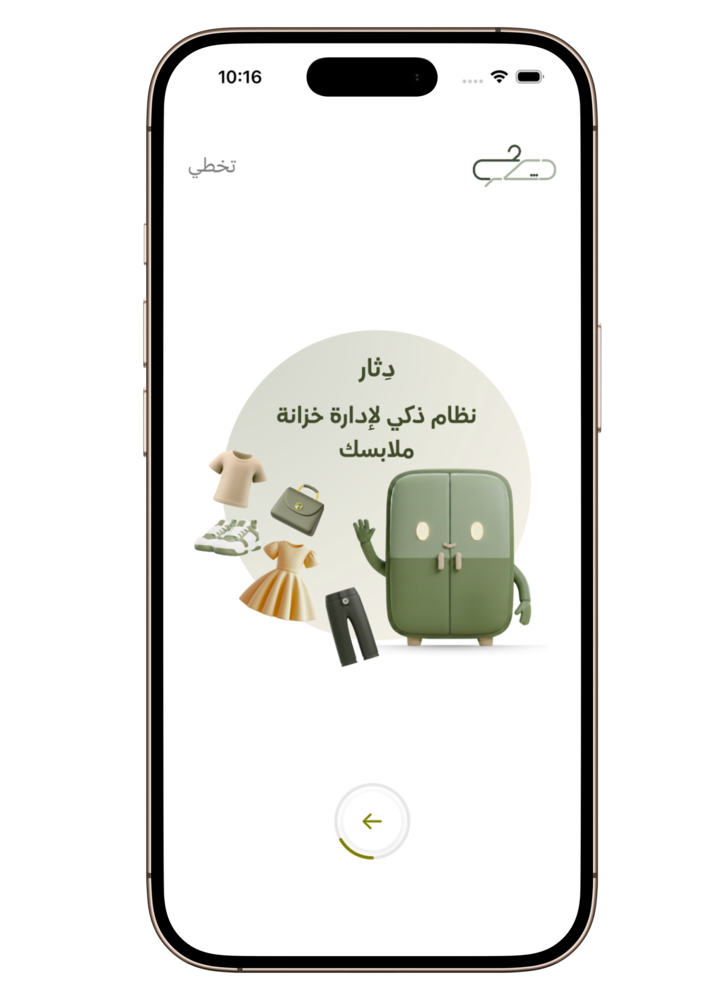
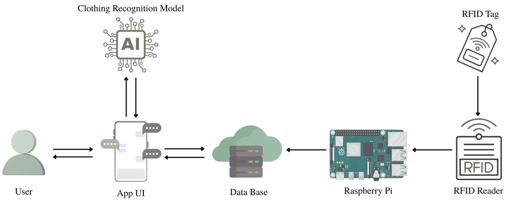
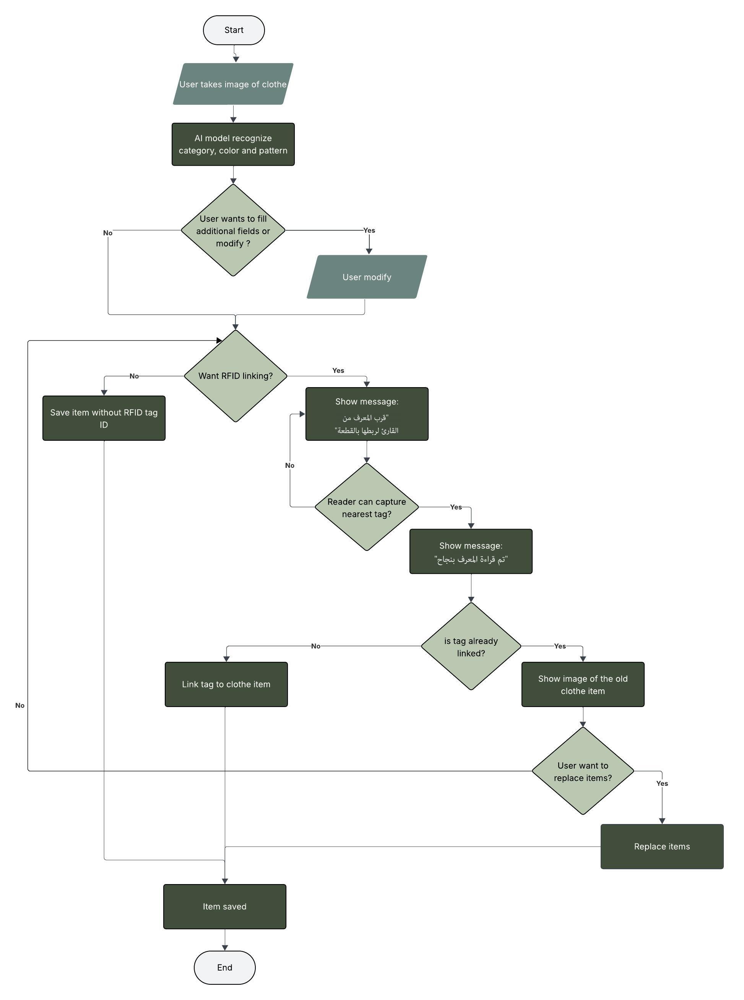
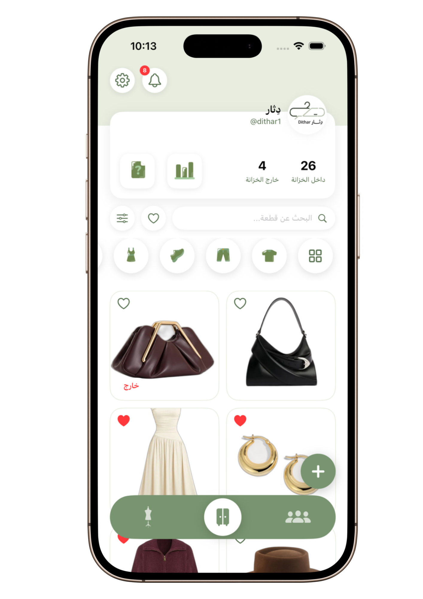
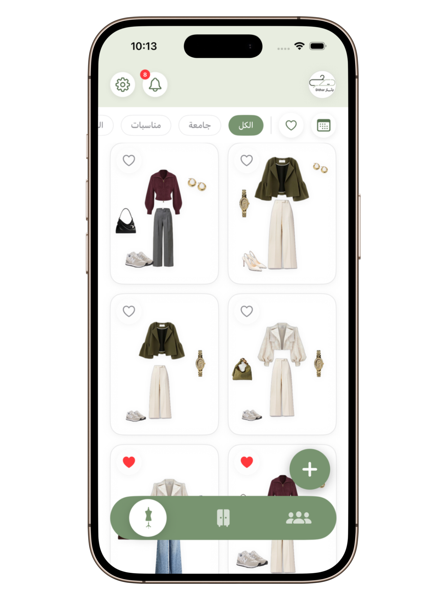
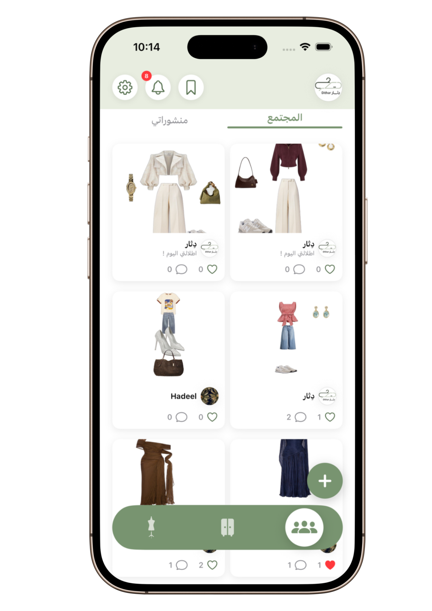
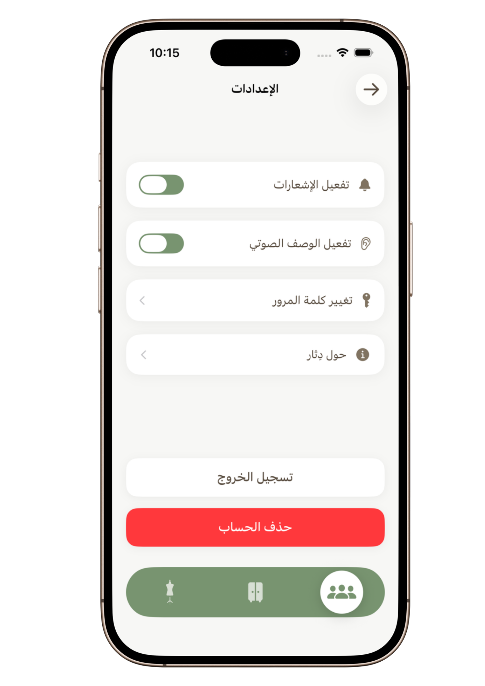

# Dithar
### Smart Wardrobe System

An intelligent wardrobe management system designed to simplify clothing organization through AI-powered recognition, RFID-based tracking, and accessible audio interaction.

[Demo](PUT_DEMO_LINK_HERE) • [Website](PUT_WEBSITE_LINK_HERE) • [Screenshots](#screenshots) • [Installation](#installation)

---

## Overview

Dithar is a smart wardrobe system that helps users organize clothing items, identify garments more easily, and make outfit decisions with greater efficiency and independence. The project combines a mobile application with AI-based clothing recognition and RFID technology to maintain a real-time clothing inventory and support outfit selection.

The system is designed for both ordinary users and visually impaired users. It supports daily wardrobe organization, simplifies clothing retrieval, and improves independence through audio descriptions and accessible interaction.

---

## Project Preview

  

---

## Problem Statement

Choosing what to wear can be time-consuming and frustrating, especially when wardrobes are cluttered or when clothing items are difficult to identify.

For visually impaired individuals, the challenge is even greater because distinguishing colors, patterns, and clothing categories without visual cues often requires help from others. This reduces independence and makes outfit coordination more difficult.

Dithar addresses this problem by turning a traditional wardrobe into a digital and trackable system that supports clothing recognition, item management, and accessible outfit coordination.

---

## Solution

Dithar provides a smart wardrobe experience through the integration of:

- AI-based image recognition for clothing classification
- RFID-based clothing tracking
- A mobile app for digital wardrobe management
- Audio descriptions for visually impaired users
- Outfit recommendations based on wardrobe contents
- Social sharing and interaction through community features

The system supports both practical organization and inclusive access. Clothing items can be recognized, stored, tagged, searched, filtered, and used to create outfit combinations, while visually impaired users can access garment information through speech output.

---

## Target Users

### Ordinary Users
- Users with overcrowded wardrobes
- Users who want easier clothing organization
- Users who need support in selecting outfits quickly

### Visually Impaired Users
- Users who need accessible clothing identification
- Users who benefit from audio clothing descriptions
- Users who want greater independence in outfit coordination

---

## Core Features

### 1. Add Clothes to the App
Users can take a photo of a clothing item, after which the AI model automatically analyzes and identifies its:
- type
- color
- pattern

After classification, the item can be linked to an RFID tag and saved in the user’s digital wardrobe. Users can later search for items by color, type, or last-used date.

### 2. RFID-Based Item Tracking
Each garment can be associated with an RFID tag. A reader scans the tag and links it to the clothing item, enabling future tracking and wardrobe organization.

The RFID reader identifies and tracks garments when they are added to or removed from the wardrobe, while the Raspberry Pi acts as the edge device that reads RFID data and relays it to the application/backend.

### 3. Outfit Creator
Users can browse their digital wardrobe, select clothing items from different categories, arrange them visually, and save complete outfits for future use.

Saved outfits may also include tags or notes for occasions such as casual or formal events.

### 4. Match a Similar Outfit
Through the Explore Page, users can browse outfit posts and use a **Match a Similar Outfit** feature.

The system analyzes the selected outfit, extracts key details such as clothing type and color palette, and searches the user’s own wardrobe for the closest match. When no exact match exists, the system suggests alternatives.

### 5. AI-Based Recommendations
The system generates outfit recommendations based on:
- stored wardrobe items
- clothing compatibility
- user preferences
- weather
- occasion type

As users interact more with the system, recommendations become more personalized.

### 6. Accessibility Support
A core objective of Dithar is to support visually impaired users through auditory descriptions of clothing items and audio interaction using text-to-speech.

### 7. Community Interaction
Dithar also includes social features that allow users to:
- share favorite outfits
- like and comment on shared looks
- browse community inspiration

These features promote engagement and provide additional outfit ideas.

---

## Interfaces

The project interface is organized around the main user tasks and core flows of the system.

### Wardrobe Management Interface
Displays stored items, item details, and wardrobe organization functions such as filtering and browsing.

### Add Item Interface
Captures a clothing image, reviews recognition results, and links the clothing item to RFID data before saving it.

### Outfit Creation Interface
Allows users to select clothing items, visually arrange outfits, and save combinations for later use.

### Recommendation Interface
Presents suggested outfit combinations based on available items, preferences, weather, and occasion.

### Community Interface
Allows users to browse shared outfit posts, interact with community content, and match similar looks from their own wardrobe.

### Accessibility Interface
Supports users with audio descriptions and voice-guided interaction for clothing information and navigation.

---

## System Architecture

  

Dithar combines a mobile application, AI recognition, cloud data management, and RFID hardware into one integrated system. The overall system flow includes clothing image capture, AI-based classification, RFID tag linking, digital wardrobe storage, and user-facing outfit management.

---

## System Workflow

  

The workflow begins when a user captures a clothing image. The system then recognizes the clothing item, optionally allows the user to modify additional details, supports RFID linking, and finally saves the clothing item into the wardrobe system.

---

## Project Scope

The scope of Dithar includes:
- an iOS mobile application
- RFID-based clothing tracking
- AI-based clothing recognition
- digital wardrobe organization
- outfit recommendations
- auditory descriptions
- Arabic language support

Advanced functions such as augmented reality fitting, fabric analysis, and e-commerce integration are outside the current project scope.

---

## Project Objectives

### Product Objectives
The project aims to:
- manually arrange and save outfits
- track whether clothing items are inside or outside the closet
- recognize clothing items automatically
- add and link clothing items with RFID tags
- support visually impaired users with auditory descriptions
- generate outfit recommendations
- allow community sharing
- enable likes and comments
- provide search and filtering options
- save custom outfits for specific events

### Development Objectives
The project development includes:
- identifying and evaluating AI models for clothing recognition
- purchasing and testing RFID equipment and Raspberry Pi
- designing and implementing the database
- connecting Raspberry Pi with the RFID reader
- connecting Raspberry Pi with the database
- designing the user interface
- developing the iOS app using Xcode
- implementing recommendation logic
- integrating AVSpeechSynthesizer
- conducting application testing

---

## Technology Stack

### Mobile Application
- Swift
- SwiftUI
- Xcode
- iOS application development

### Database and Cloud Services
- Firebase Firestore
- Firebase Storage
- Firebase Authentication

### AI and Recognition
- CLIP-based clothing recognition
- Google Vision API
- DeepFashion-based clothing analysis
- Rule-based recommendation logic

### Accessibility
- AVSpeechSynthesizer (Text-to-Speech)
- VoiceOver support

### Hardware Integration
- UHF RFID Reader
- UHF RFID Tags
- Raspberry Pi
- Python scripts for hardware communication
- Visual Studio Code for Raspberry Pi integration

---

## Hardware and Software Resources

### Hardware
- UHF RFID Reader
- UHF RFID Tags
- Raspberry Pi
- iPhone test device

### Software
- Xcode IDE
- Firebase
- CLIP-based recognition
- AVSpeechSynthesizer
- Visual Studio Code

---

## Results and Project Value

Dithar delivers value in several ways:

- improves wardrobe organization
- reduces time spent choosing outfits
- supports more efficient use of stored clothes
- reduces reliance on others for visually impaired users
- enables more confident outfit coordination
- supports social sharing and inspiration
- combines accessibility, RFID tracking, and AI within one integrated system

---

## Screenshots

| Wardrobe | Outfits | Community | Accessibility |
|----------|---------|-----------|---------------|
|  |  |  |  |

---

## Team

Prepared by:

- Rahaf AlFantoukh
- Hadeel Almutairi
- Maha Alswed
- Fatimah Alsufaian

Supervised by:

- Dr. Wejdan Alkhaldi

---

## Acknowledgments

- King Saud University
- College of Computer and Information Sciences
- Department of Information Technology

---

Developed as a graduation project focused on accessible technology, smart wardrobe management, and inclusive fashion support.

